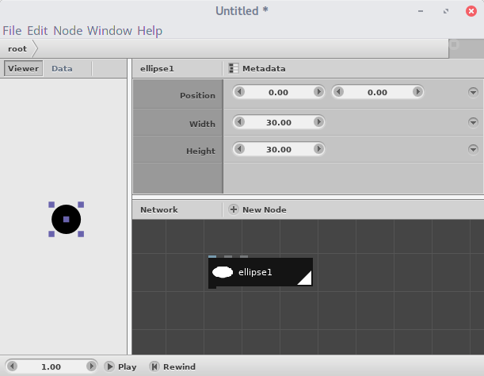

---
title: Arte computacional
author: Gustavo Henrique Montesião de Sousa
toc: true
lang: pt-BR
monofont: Ubuntu Mono
...

# Introdução

A programação está cada vez mais presente nos objetos com os quais entramos em contato no nosso dia-a-dia. Os programadores são como que os novos artesãos do mundo. Isso porque a programação se apresenta a nós como uma nova forma de comunicar ideias. Quem detém esse conhecimento é capaz de se expressar em novas formas às quais não tinha acesso anteriormente.

A verdade é que a programação nos põe em contato de maneira mais próxima com a linguagem matemática, e há uma ligação profunda entre a arte e a matemática, ligação cuja consciência fomos perdendo nos últimos séculos, à medida que as profissões foram se especializando cada vez mais.

A raiz dessa ligação está na compreensão do que verdadeiramente seja a matemática. Ela, diferentemente do que muitas vezes somos levados a crer, não existe na natureza. Não existe, nem nunca será possível existir na natureza algo como um quadrado (ou, de resto, a imensa maioria das figuras geométricas às quais nos acostumamos). No entanto, figuras como o quadrado estavam presentes em um grande número de culturas ao redor do mundo, muitas das quais separadas geográfica e culturalmente. Se, então, o quadrado não existe na natureza, como ele surgiu de forma independente em tantas culturas? Onde reside o germe dessas ideias que acabariam por gerar não só o quadrado, como também toda a matemática em si?

A matemática existe dentro da alma humana. De todo ser humano. E é por isso que ela surgiu como ciência em tantas culturas. Porque fala de nós e do que somos, fala do profundamente humano. A matemática, como as artes, é uma linguagem que comunica experiências vivenciadas no íntimo do nosso espírito. Estudá-la equivale a compreender quem profundamente somos.

Neste pequeno curso, vamos nos aventurar pelos princípios da programação, no que ela pode ser útil para as artes gráficas. Para tanto, vamos usar um programa chamado `nodebox` (<https://www.nodebox.net/>), que é um ambiente de programação focado em artes gráficas. Então vá em frente, clique no *link* acima e instale a versão 3 do programa, que vamos começar a ver os primeiros conceitos dessa nova arte.

## Notação

Como o código do `nodebox` é visual, vamos usar a notação exemplificada abaixo:

{width=30%}

Ou seja, cada bloco será representado pelo seu nome entre colchetes; os parâmetros que aparecerem ao lado do nome são aqueles cujos valores foram *alterados*, ou seja, os que são *diferentes do valor padrão*. Os parâmetros que continuam com valor padrão não serão representados.

# Listas

Um dos conceitos mais importantes em programação é o de *lista*. Uma lista é, basicamente, uma sequência de valores quaisquer. Assim, por exemplo, a lista dos 10 primeiros números primos é:

	2, 3, 5, 7, 11, 13, 17, 19, 23 e 29.

Mas uma lista não precisa ser composta por números. A seguir, temos a lista dos 7 primeiros polígonos:

{width=40%}

Listas são importantes porque, aprendendo a manipulá-las, aprendemos a manipular qualquer sequência de coisas.

O `nodebox` possui diversos blocos para gerar e manipular listas. Há, por exemplo, o `[sample]`, que gera uma lista de números:

![O bloco `[sample]`, que gera uma lista de números.](Figuras/1 - Listas/sample.png){width=50%}

Outro bloco importante é o `[grid]`, que gera uma lista de posições:

![O bloco `[grid]`, que gera uma lista de posições, ou seja, uma lista de coordenadas (x,y).](Figuras/1 - Listas/grid.png){width=100%}

## Uma galáxia colorida

Vamos usar listas para desenhar uma galáxia colorida:

{width=40%}

Os passos serão os seguintes:

* gerar uma lista de bolinhas;
* gerar várias cópias dessas bolinhas e dispô-las de forma circular;
* modificar a lista de bolinhas para que elas tenham raios de tamanhos diferentes;
* colori-las;
* inserir movimento à galáxia.

### Gerando uma lista de bolinhas

Para gerar uma bolinha, usamos o bloco `[ellipse]`:

{width=50%}

Note que o bloco `[ellipse]` tem 3 argumentos: posição (`position`), largura (`width`) e altura (`height`). Coloque a largura e a altura com o valor de no máximo 30.

O primeiro argumento do bloco `[ellipse]` é uma posição, mas se eu passar para ele uma *lista de posições*, ele vai me gerar uma *lista de elipses*, que é justamente o que desejo.

Quem sabe gerar uma *lista de posições* é o bloco `[grid]`. Então insira um `[grid]` no seu código e conecte a saída dele à entrada de *posição* do bloco `[ellipse]`. Configure os argumentos do `[grid]` conforme a figura:

{width=70%}

### Dispondo as bolinhas circularmente

Vamos usar o bloco `[copy]` para dispor a lista de bolinhas de maneira circular:

{width=70%}

### Bolinhas com raios diferentes

O resultado visual ainda não ficou bom. Isso porque seria melhor se as bolinhas que estão mais ao centro do círculo fossem menores que as da periferia. Para conseguir esse efeito, precisamos gerar uma lista de números crescentes para passarmos como valores para os raios dos círculos. Um bloco capaz de gerar uma lista crescente de números é o `[sample]`, conforme pode ser visto a seguir:

{width=50%}

 Vamos, pois, usar um `[sample]` para gerar essa lista de raios e conectá-la aos argumentos *largura* e *altura* da elipse, como no exemplo abaixo:

{width=70%}

Note como os círculos agora começam pequenos e vão crescendo, de acordo com os valores passados como raio pelo `[sample]` (de 10 a 35).

Vamos, então, fazer a alteração sugerida pelo exemplo acima no código da nossa galáxia:

{width=70%}

Por fim, para evitar que as bolinhas se sobreponham no círculo, precisamos deslocá-las um pouco, de modo que a bolinha menor fique no centro do círculo. Isso pode ser alcançado alterando o parâmetro `position` do `[grid]`, fazendo-o se deslocar para a direita pela metade do valor da sua largura^[Como o valor do parâmetro `width` do `[grid]` é `300`, então o valor em `x` do parâmetro `position` deve ser `150`.]:

{width=80%}

### Colorindo

Vamos agora colorir as bolinhas com cores diferentes. O primeiro passo é inserir um bloco `[colorize]`:

{width=80%}

Mas isso só me permite usar 1 cor para todas as bolinhas. Para ter cores diferentes, preciso criar uma lista de cores. Isso eu faço usando um bloco `[hsb_color]` e um `[sample]` para gerar uma lista de matizes:

{width=100%}

Uma vez gerada a lista de cores, basta eu conectá-la à entrada correspondente do `[colorize]`:

{width=100%}

### Inserir movimento

Pronto! Já tenho uma galáxia colorida. A única coisa que falta é dar-lhe movimento. Para tanto, não é necessário inserir nenhum outro bloco, basta mexer nos parâmetros do código que fizemos. A figura do começo da seção, por exemplo, é feita atribuindo os seguintes parâmetros:

{width=100%}

Agora, busque alterar livremente os parâmetros do código para criar variações da imagem e ver em que eles influenciam o resultado final, até achar uma figura que te agrade.

# Abstrações

> “Havia aprendido sem esforço o inglês, o francês, o português, o latim. Suspeito, contudo, que não era muito capaz de pensar. Pensar é esquecer diferenças, é generalizar, abstrair. No mundo abarrotado de Funes não havia senão detalhes, quase imediatos.”
>
> Jorge Luis Borges, “Funes, o memorioso”. Ficções, 1944

O que a programação tem a oferecer de mais precioso para as artes talvez seja a capacidade de criar generalizações. Em vez de modelar manualmente inumeráveis e irrepetíveis agulhas de uma catedral gótica, pode-se definir abstratamente o que seja uma agulha e deixar que o programa gere os incontáveis modelos 3D concretos, as realizações da abstração. Isso dá ao artista um poder de criação impossível de ser alcançado de outra forma.

Veremos nesta seção quais são as ferramentas que o `nodebox` oferece para se criarem generalizações. Para tanto, vamos aprender como definir abstratamente flores como as seguintes:

{width=50%}

Nenhum desses 5 desenhos é igual ao outro: cada um tem um número diferente de pétalas (3, 5, 7, 9 e 11 respectivamente). No entanto, a todas elas podemos dar o mesmo nome: flor. Fizemos, pois, uma generalização.

## Desenhando uma flor

Comecemos com um caso específico: vamos desenhar uma flor. Para isso, vamos usar um bloco chamado `[coordinates]`, que permite definir um ponto $(x,y)$ a partir de suas coordenadas polares (ou seja, um ângulo e uma distância com relação à origem).

![O bloco `[coordinates]` sendo usado para gerar um ponto a 45° e raio 100](Figuras/2 - Abstrações/coordinates.png){width=50%}

Se o `[coordinates]` receber uma lista de valores para o ângulo (lista que pode ser gerada com o bloco `[sample]`), será gerada uma lista de pontos dispostos ao longo de um arco:

{width=35%}

Se passarmos também uma lista de valores para a distância, obteremos uma lista de pontos dispostos em espiral:

{width=30%}

Aconselho que, antes de seguir a lição, você gaste um tempo explorando diferentes valores para o ângulo e a distância, para que assim desenvolva uma melhor intuição sobre como o `[coordinates]` funciona.

### Ligando os pontos

Uma vez de posse de uma lista de pontos, blocos podemos ligá-los usando um bloco chamado `[connect]`:

{width=30%}

### Pétalas

Estamos usando dois `[sample]` para gerar as listas de ângulos e de distâncias, e, por enquanto, ambos geram 10 elementos (que é o valor padrão do argumento `amount` do `[sample]`). O que acontece se passarmos a gerar 20 ângulos mas mantivermos as 10 distâncias? Vejamos:

{width=50%}

O programa desenha duas pétalas! Você consegue explicar por quê?

Tentemos aumentar o número de ângulos para 30:

{width=50%}

Agora o programa desenhou 3 pétalas. Isso significa que se o número de ângulos (neste caso, 30) for $n$ vezes o número de distâncias (que aqui é 10; ou seja, o número de ângulos é 3 vezes maior que o de distâncias), ele vai me gerar $n$ pétalas.

Ótimo! Estamos quase conseguindo desenhar uma flor. Falta agora dispor essas pétalas em um círculo completo, pois aqui elas só estão ocupando 90°.

### Circuladô de fulô

Para dispor as pétalas em um círculo completo, basta alterar o primeiro `[sample]` (o que determina os valores para os ângulos) para que o parâmetro *End* seja 360°, conforme a figura:

{width=60%}

Pronto! Temos nossa flor!

## Meias pétalas e variáveis

Mas e se o número de ângulos não for múltiplo do número de distâncias? Por exemplo, e se eu gerar 35 ângulos e 10 distâncias? Bom, aí teremos meias pétalas:

{width=55%}

Para garantir que geraremos apenas pétalas inteiras, precisamos dar um jeito de fazer que a quantidade de ângulos e de distâncias estejam atreladas. Para tanto, vamos definir uma variável.

### Variáveis

Variáveis são nada mais nada menos que bloquinhos que guardam valores. No nosso caso, vamos usar um bloco chamado `[number]` pra armazenar o *número de pétalas* que queremos para a nossa flor. Depois vamos usar um outro bloco, o `[multiply]`, para multiplicar o número de pétalas pela quantidade de *distâncias*, obtendo assim a quantidade de *ângulos*, conforme a figura:

{width=100%}

Note como o bloco `[number1]` armazena o número de pétalas (3), enquanto que o bloco `[number2]` armazena a quantidade de distâncias. Para tornar isso mais claro no código, vou renomeá-los para `[petals]` e `[distances]` respectivamente^[Para renomear um bloco, clique nele com o botão direito e escolha a opção *Rename*.]:

{width=50%}

Pronto! Agora a quantidade de distâncias e de ângulos estão ligadas. Acabamos de aprender a primeira ferramenta de abstração: *a criação de uma variável*.

## Flores, funções e abstrações

E se agora eu quiser criar uma lista de flores, cada uma com uma quantidade diferente de pétalas? Eu terei que dar `Ctrl+C Ctrl+V` no meu código várias vezes? Não. O `nodebox` permite que eu defina novos blocos que servem como caixinhas para armazenar um código que eu criei. Depois posso usar esse novo bloco várias vezes no meu código.

Esses novos blocos definidos por blocos são chamados de *children* na nomenclatura do `nodebox`. Já no contexto das linguagens de programação em geral, isso é chamado de *função*.

Vamos aprender a criar um novo bloco que contenha nosso código e vamos chamá-lo de `[flower]`. Selecione todo o seu código, clique com o botão direito em algum dos blocos selecionados e escolha a opção *Group into Network*. Ele vai pedir um nome, no que você pode escrever *flower*. Note como todo o código foi substituído por um único bloco com o nome que escolhemos:

{width=50%}

Note também que esse bloco `[flower]` não possui nenhum argumento (nenhum *input*), então não consigo passar pra ele a quantidade de pétalas que quero. Precisamos arrumar isso. Para tanto, clique em `[flower]` com o botão direito e escolha a opção *Edit Children*. Isso vai permitir que visualizemos o código de dentro do bloco.

Agora, para permitir que digamos ao `[flower]` quantas pétalas queremos que ele gere, clicamos com o botão direito no argumento (no *input*) do bloco `[petals]` (conforme figura) e clicamos em *Publish*. Ele vai perguntar que nome você quer dar para esse argumento. Escreva *petals*.

{width=100%}

Pronto! Agora, para voltar à edição do código principal, clique em *root* na barra de ferramentas:

{width=50%}

Você vai ver que, agora, o bloco `[flower]` tem um argumento (o argumento *petals*). A partir de agora, você já pode utilizá-lo para gerar quantas flores quiser:

{width=80%}

# Aleatoriedade

Na seção anterior, aprendemos a definir desenhos no `nodebox` de maneira abstrata. Isso nos permitiu gerar uma variedade de desenhos a partir de uma única definição. Nesta seção, vamos aprender como inserir variações aleatórias aos nossos desenhos.

## Pseudoaleatoriedade

> “Um lance de dados jamais abolirá o acaso”.
>
> Mallarmé, Um lance de dados, 1897

Um computador, sendo uma máquina, só é capaz de fazer aquilo que foi programado pra fazer. Ele exibe um comportamento determinístico portanto. Sendo assim, é incapaz de gerar números verdadeiramente aleatórios. Por isso, quase sempre ele precisa que lhe seja fornecido um primeiro número a partir do qual ele pode sortear uma sequência de números aleatórios. Esse primeiro número que lhe é fornecido pelo usuário é chamado de *semente*. É por isso que todo bloco do `nodebox` que gera números aleatórios possui um argumento chamado *seed*.

## Uma personagem inesperada

Nesta aula, vamos aprender a criar uma série de personagens pixeladas produzidas de maneira aleatória:

{width=60%}

Cada personagem da figura é desenhada pintando ao acaso quadradinhos em um *grid* 6x8 e espelhando o resultado para se conseguir uma simetria vertical. Em detalhes, os passos são os seguintes:

* gerar um *grid* 6x8;
* sortear, dessas 48 casas do *grid*, 30 casas que serão pintadas;
* pintar essas 30 casas com quadradinhos;
* refletir verticalmente o resultado para que fique simétrico;
* colocar todo esse código em um novo bloquinho.

### Gerar um *grid*

Já sabemos como gerar um *grid* 6x8: insira um bloco `[grid]` no seu código e configure seus parâmetros conforme a figura:

{width=40%}

### Sortear 30 casas

O *grid* está nos gerando uma lista com 48 pontos^[$6 · 8 = 48$]. Desses 48 pontos, queremos sortear 30. Para tanto, vamos usar um bloco chamado `[pick]`. O `[pick]` é um bloco que recebe uma lista e escolhe ao acaso um subconjunto dela. Por exemplo, se tenho a seguinte lista:

> 	1, 2, 3, 4, 5, 6, 7, 8, 9, 10

e peço para o `[pick]` me escolher 5 desses valores, ele vai me gerar:

> 	5, 9, 10, 7, 4

caso seu valor de *seed*^[Para maiores informações sobre o parâmetro *seed*, ver seção [Pseudoaleatoriedade] ] seja $1$.

Sendo assim, basta conectar o `[grid]` ao `[pick]` e colocar em *Amount* o valor $30$.

{width=40%}

### Pintar as casas

Agora basta conectar um `[rect]` ao `[pick]`:

{width=40%}

### Simetria vertical

Agora, para finalizar, basta refletir a imagem no eixo vertical. Para tanto, usamos um `[reflect]`:

{width=40%}

Note como foi necessário alterar o argumento *Position* do `[reflect]` para $(25,0)$ para alinhar o eixo de reflexão.

### Abstraindo

Agora, basta definir um novo bloquinho contendo todo o código:

* selecione todos os blocos;
* clique em qualquer um deles com o botão direito;
* no menu que aparecer, escolha *Group into Network*;
* nomeie o bloquinho como *personagem*.

Está pronto! Agora podemos gerar variações aleatórias da nossa personagem apenas alterando o argumento *Seed* do `[pick]`. Experimente.

## Em formação!

Vamos colocar nossas personagens lado-a-lado em um *grid* 5x5 para observarmos suas variações, conforme a figura do (início da seção)[#aleatoriedade]. Para fazer isso, precisamos inserir um argumento de posição no nosso recém-criado bloco `[personagem]`, caso contrário não é possível conectá-lo ao `[grid]`.

Para fazer isso, procedemos como na (aula passada)[#abstrações] : inserimos um `[translate]` ao final do nosso código e exportamos o argumento *Translate*, dando para ele o nome de *posição*:

{width=40%}

Agora sim podemos conectá-lo ao `[grid]`:

{width=50%}

Como você pode notar, todas as personagens são iguais, sem variação. Isso é porque não estamos alterando o valor do argumento *Seed* do `[pick]` dentro da personagem. Para poder alterá-lo, vamos ter que exportá-lo também. Entre no código da personagem clicando com o botão direito sobre ela e escolhendo a opção *Edit children*. Em seguida, exporte o argumento *Seed* do `[pick]` e nomeie-o *variação*:

{width=100%}

Agora vamos usar um bloco semelhante ao `[sample]` para gerar uma lista de valores de semente para injetar no argumento *Variação* da nossa personagem. Esse bloco semelhante ao `[sample]` se chama `[range]`.

O `[range]` gera uma lista de números baseado em um *valor inicial*, um *valor final* e um *passo*. O *passo* diz de quantos em quantos números o `[range]` deve andar para sair do *valor inicial* e chegar ao *valor final*. Assim, por exemplo, um `[range]` com *valor inicial* 1, *valor final* 9 e *passo* 2 vai gerar a seguinte lista:

> 	1, 3, 5, 7, 9

Queremos usar o `[sample]` pra gerar uma lista de números para o argumento *Variação* do `[personagem]`. Queremos que o *valor inicial* seja 1 e o *valor final* seja igual ao número total de casas no *grid*. Para tanto, vamos usar um `[count]`, que conta quantos elementos há numa lista. O resultado final ficará assim:

{width=90%}

# Técnicas de manipulação de listas

Como dito na seção [*Listas*](#listas), as listas são um conceito muito importante dentro da programação. Por isso, nesta seção vamos ver alguns exemplos em que vamos precisar manipular listas de formas diferentes. Esses exemplos serão úteis para ampliar nosso repertório como programadores e como artistas.

## Um horizonte provável

Nossa motivação hoje vai ser montar uma *skyline* composta por torres feitas de blocos com tamanhos aleatórios:

{width=80%}

Os passos para programar esse desenho serão os seguintes:

* gerar vários retângulos com largura e altura escolhidas aleatoriamente;
* programar um bloquinho capaz de empilhá-los;
* programar um terceiro bloquinho capaz de dispô-los horizontalmente.

## Uma variedade de blocos

Vamos começar gerando uma lista de retângulos com tamanhos variados. Para tanto, vamos sortear valores para a altura e a largura de um `[rect]` usando dois `[random_numbers]`:

{width=100%}

Isso vai nos dar uma lista de retângulos sobrepostos com dimensões aleatórias. Para ficar mais fácil a visualização, vamos colocar uma borda branca neles usando um `[colorize]`:

{width=50%}

Como a quantidade de números gerados pelos dois `[random_numbers]` é igual (eles têm o mesmo valor de *amount*), vamos criar uma nova variável para armazenar esse valor: crie um bloquinho `[integer]` e conecte-o ao *amount* do `[random_numbers1]` e do `[random_numbers2]`. A seguir, renomeie o `[integer]` para `[amount]`:

{width=100%}

Agora vamos aprender como empilhá-los para formar uma torre.

## Empilhadeira programável

Uma maneira simples de empilhar os retângulos seria usando um `[stack]` conforme a figura abaixo:

{width=50%}

Entretanto, para que possamos exercitar nossa capacidade de manipular listas (neste caso, uma lista de retângulos com alturas variáveis), nós mesmos vamos programar um bloquinho capaz de fazer isso.

### Um acumulador

A primeira observação que precisamos fazer é que, se queremos empilhar os retângulos, precisamos saber a que altura colocar cada um deles. Mas a dificuldade está em que cada retângulo tem uma altura diferente, já que é escolhida aleatoriamente. No nosso exercício, as alturas são sorteadas pelo `[random_numbers2]`, e podem ser vistas na figura a seguir:

{width=50%}

No exemplo concreto da figura, as alturas dos 10 retângulos são, aproximadamente:

> 25, 32, 24, 46, 48, 29, 39, 22, 34, 43.

A que altura vamos colocar cada um dos 10 retângulos? A resposta é a seguinte:

* o primeiro retângulo será colocado à altura 0;
* o segundo, à altura 25;
* o terceiro, à altura 57 (porque $25+32 = 57$);
* o quarto, à altura 81 (porque $25+32+24 = 81$);
* o quinto, à altura 127 (porque $25+32+24+46 = 127$);
* ...

{width=60%}

Bem, você já deve ter notado que a altura a que será colocado um retângulo é o valor acumulado das alturas dos retângulos anteriores. Em termos algébricos,

> $H_n = h_1 + h_2 + ... + h_{n-1}$,

sendo $H_n$ a altura a que será colocado o retângulo de número $n$ e $h_n$ a altura individual do retângulo $n$.

Portanto, precisamos construir um bloquinho capaz de acumular os valores das alturas até o elemento anterior^[Ou seja, para o **terceiro** retângulo, acumular o valor das alturas dos **dois** primeiros retângulos; para o **quarto** retângulo, o valor das alturas dos **três** primeiros, e assim por diante.], gerando a seguinte lista de valores:

----------
         0
   25,6558
   58,3873
   82,6662
  129,3238
  178,2246
  207,9743
  247,2667
  269,7312
  303,8807
----------

Table: Valores acumulados das alturas.

Como vimos, as alturas são uma lista gerada pelo `[random_numbers2]`. O que precisamos fazer é conseguir selecionar os $n$ primeiros elementos dessa lista de alturas e somá-los. Mas como selecionar os $n$ primeiros elementos de uma lista? Usando um bloquinho chamado `[slice]`, que recorta fatias de uma lista. Veja como ele é aplicado na figura abaixo para selecionar os 4 primeiros elementos da lista de alturas:

{width=50%}

Note como a saída do `[slice1]` é justamente a lista das 4 primeiras alturas:

> 25, 32, 24, 46.

Agora, para construir o acumulador, basta conectar ao `[slice1]` um bloquinho chamado `[sum]`, que soma todos os elementos da lista:

{width=50%}

Pronto! Vamos selecionar o `[slice1]` e o `[sum1]` e criar um novo bloquinho com eles chamado `[accumulator]`:

{width=50%}

Nosso `[accumulator]` por enquanto só seleciona uma fatia de 4 elementos da lista de alturas. Precisamos exportar um argumento que nos permita dizer quantos elementos queremos. Para isso, entre no `[accumulator]`^[Clique com o botão direito e escolha a opção *Edit Children*.] e exporte o argumento *size* do `[slice1]` (pode chamar o argumento exportado de *size*):

{width=100%}

Está pronto nosso acumulador. Agora só precisamos conectá-lo a uma lista de valores de $n$ indo de 0 a 9 (pois temos 10 retângulos) para conseguir uma lista acumulada de alturas semelhante à da tabela acima.

{width=100%}

### Uma lista de pontos

Agora precisamos usar os valores das alturas calculados pelo `[accumulator]` para criar uma lista de pontos que vamos depois usar para mover os retângulos usando um `[translate]`. Essa lista de pontos é criada conectando o `[accumulator]` ao segundo argumento de um bloquinho chamado `[make_point]`:

{width=50%}

Note pela figura que os pontos gerados estão saindo da origem e indo para baixo em vez de irem para cima. Isto é porque no `nodebox` o eixo Y aponta para baixo. Para que os nossos pontos sejam desenhados pra cima, precisamos inverter o sinal dos valores gerados pelo `[accumulator]` usando um bloquinho chamado `[negate]`:

{width=50%}

Para finalizar e ajudar a manter nosso código organizado, vamos selecionar o `[range1]`, o `[accumulator]`, o `[negate1]` e o `[make_point1]` e gerar um novo bloquinho com eles, que vamos chamar de `[vertical_points]`:

{width=50%}

### Empilhando as caixas

Uma vez gerada a lista de pontos com o `[vertical_points]`, podemos enfim usá-la para posicionar nossos retângulos com o auxílio de um bloquinho `[translate]`:

{width=50%}

Note, todavia, que o encaixe dos retângulos não é perfeito. Isto se deve ao fato de que os desenhos no `nodebox` são, por padrão, alinhados por seu ponto central. E os nossos cálculos todos pressupuseram que o alinhamento se daria bela parte de baixo dos retângulos. Para corrigir isso, precisamos usar um bloquinho chamado `[align]`:

{width=50%}

Agora sim! Conseguimos por fim empilhar os retângulos com alinhamento perfeito.

## Uma torre e todas as torres

Tudo o que fizemos até agora foi aprender a desenhar uma única torre. Mas já sabemos que podemos criar uma generalização definindo um bloquinho novo e, como ele, criar qualquer torre com qualquer variação.

Façamos isso.

Selecionemos todos os bloquinhos na raiz, cliquemos com o botão direito e escolhamos *Group into Network*. Agora nomeemos o novo bloquinho como `[tower]`.

{width=50%}

Precisamos agora criar argumentos no nosso novo bloquinho para permitir criar torres variadas. Os argumentos que permitem gerar variações na nossa torre são os *seeds* dos dois `[random_numbers]`. Vamos então entrar no `[tower]`^[Clique com o botão direito e escolha *Edit Children*] e criar um novo bloquinho `[integer]` que vai armazenar o valor dos *seeds* para podermos exportar. Em seguida, conectemos o `[integer]` ao `[random_numbers1]` e ao `[random_numbers2]`, tomando o cuidado de fazer uma adição ao valor do *seed* antes de conectar ao `[random_numbers2]` (você sabe dizer por que isso é necessário?):

{width=50%}

Vamos renomear o `[integer1]` para `[variation]`:

{width=50%}

E exportemos o argumento do `[variation]`:

{width=50%}

Agora, alterando o valor do argumento *Variation* do nosso recém-criado `[tower]`, conseguimos gerar torres com vários formatos. A única coisa que ainda não está variando na nossa torre é quantidade de retângulos. Para tanto, precisamos alterar o bloquinho `[amount]` para gerar um número aleatório para a quantidade de caixas. Façamos isso:

{width=50%}

O último passo para conseguir variação nas alturas é conectar o `[variation]` ao *seed* do `[random_numers3]`:

{width=50%}

## Tecendo a manhã

O próximo exercício será desenhar a malha exibida na figura a seguir:

{width=50%}

Para chegar lá, vamos aprender passo-a-passo os novos bloquinhos de que vamos precisar.

### `[first]` e `[rest]`

Os primeiros dois bloquinhos são o `[first]` e o `[rest]`.

O `[first]` recebe uma lista e devolve o seu primeiro elemento. Por exemplo, considere a lista de números gerada pelo seguinte `[range]`:

{width=30%}

Ele vai gerar a seguinte lista:

> 1, 2, 3, 4, 5, 6, 7, 8, 9, 10.

Conectando-o a um `[first]`, obtemos o número *1*, que é o primeiro número da lista:

{width=30%}

O `[rest]` funciona ao contrário do `[first]`: ele devolve todos os elementos de uma lista exceto o primeiro. Assim, o seguinte código:

{width=30%}

gerará a seguinte lista:

> 2, 3, 4, 5, 6, 7, 8, 9, 10.

### `[take_every]`

O `[take_every]` extrai de uma lista 1 elemento a cada $n$. Por exemplo, se o seguinte código:

{width=30%}

gera a lista

> 1, 2, 3, 4, 5, 6, 7, 8, 9, 10,

então

{width=30%}

gerará a lista

> 1, 3, 5, 7, 9,

pois ele pega 1 de cada 2 elementos da lista. Da mesma forma,

{width=30%}

gerará a lista

> 1, 4, 7, 10,

pois ele pega 1 de cada 3 elementos.

### `[shift]`

O último bloquinho de que vamos precisar é o `[shift]`. Ele desloca os elementos da lista, fazendo o primeiro virar o segundo, o segundo virar o terceiro, o terceiro virar o quarto... até que o último vira o primeiro. Mas é mais fácil de entender observando um exemplo. O seguinte código:

{width=30%}

gera a lista a seguir:

> 2, 3, 4, 5, 6, 7, 8, 9, 10, 1.

Já o código

{width=30%}

gera a lista:

> 3, 4, 5, 6, 7, 8, 9, 10, 1, 2.

### À malha

Pois bem, aprendidos os bloquinhos de que vamos precisar, podemos finalmente nos ocupar do desenho da malha. O processo será o seguinte: vamos começar gerando um círculo de pontos:

{height=15%}

Depois, vamos conectar um desses pontos a cada 4 outros pontos:

{height=15%}

E repetiremos o processo para cada ponto do círculo:

{height=15%}

#### Círculo de pontos

Para gerar um círculo de pontos, basta usarmos um `[coordinates]` conectado a um `[sample]`:

{width=50%}

#### Ligando os pontos

Agora vamos conectar um desses pontos a cada outros 4. Vamos separar o primeiro ponto usando o `[first]`:

{width=30%}

Para separar os outros pontos, que serão escolhidos a cada 4, vamos usar um `[take_every]`:

{width=50%}

A conexão será feita usando um `[line]`, que desenha uma linha entre 2 pontos:

{width=50%}

#### Repetindo o processo

Agora precisamos fazer o mesmo para cada um dos outros pontos. Para escolher um outro ponto como vértice, podemos rotacionar a lista gerada pelo `[coordinates]` usando um `[shift]`:

{width=50%}

Note que o resultado ficou diferente do que se esperava. Em vez de:

{width=20%}

esperava-se:

{width=20%}

Isto é porque o seguinte trecho do código:

{width=30%}

está gerando dois pontos iguais: um no ângulo 0° e outro no ângulo 360°, pois 0° e 360° são o mesmo ângulo.

Para resolver isso, vamos remover um dos dois. O mais fácil é remover o primeiro usando um `[rest]`:

{width=30%}

Pronto! Agora conseguimos trocar o ponto que será vértice apenas alterando o valor do argumento *amount* do `[shift]`. Também conseguimos controlar a quantos pontos nosso vértice está ligado alterando o argumento *n* do `[take_every]`.

Como os 4 bloquinhos que vão do `[shift]` ao `[line]` servem para desenhar as conexões, vamos agrupá-los num bloquinho próprio e chamá-lo de `[connect_every]`:

{width=30%}

e, dentro do `[connect_every]`, vamos publicar os três argumentos que nos permitirão manipular nosso bloquinho:

{width=25%}

Por fim, para que todos os vértices estejam conectados, vamos usar um `[range]` para gerar todos os números de vértices e passá-los ao argumento *vertex* do `[connect_every]`:

{width=30%}
